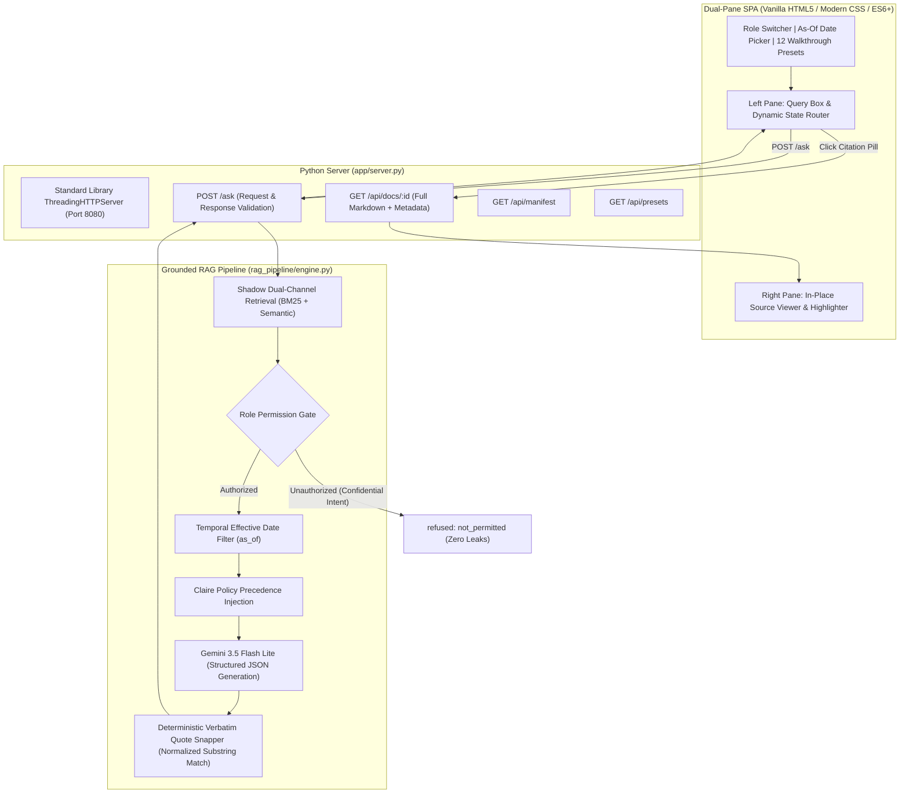

# Ask the Tenant Book — openigloo Assistant

[](https://www.python.org/)
[]()
[](https://ai.google.dev/)
[]()

A production-grade, authoritative web user interface and grounded RAG backend assistant built for New York City renters, landlords, and openigloo staff.

The system answers housing law and platform policy questions strictly from a verified corpus of 30 official documents. It quotes source documents verbatim, refuses questions outside the corpus or restricted by role, clearly surfaces governing rules when documents conflict, and remains accurate under rule changes.

---

## Table of Contents

1. [Overview & Problem Statement](#overview--problem-statement)
2. [Qualification Bar 6 ("Frontend Fidelity") Compliance](#qualification-bar-6-frontend-fidelity-compliance)
3. [Architecture & System Design](#architecture--system-design)
4. [Domain-Aware Grounded RAG Pipeline](#domain-aware-grounded-rag-pipeline)
5. [The 12 Reviewer Walkthrough Benchmark Scenarios](#the-12-reviewer-walkthrough-benchmark-scenarios)
6. [Quick Start & Execution](#quick-start--execution)
7. [Automated Testing & Grader](#automated-testing--grader)
8. [Repository Structure](#repository-structure)

---

## Overview & Problem Statement

New York City housing law is complex, highly amended, and spread across statutory codes, administrative guidelines, and platform listing standards:
- **General Obligations Law (GOL § 7-108)**: 14-day security deposit returns and the statutory one-month cap.
- **Fairness in Apartment Rental Expenses (FARE Act / NYC Admin Code § 20-699.21)**: Prohibits landlord agents from collecting broker fees from tenants.
- **Rent Guidelines Board (RGB Orders #55, #56, #57)**: Annual lease renewal adjustment percentages.
- **Housing Maintenance Code (HMC)**: Minimum winter heat and hot water standards.
- **openigloo Assistant Policy Book (`claire_policy.md`)**: Internal platform standards that strictly bind the assistant (e.g. zero exceptions for security deposits, strict bans on calculating personal rent increases, and mandatory human escalation for voucher discrimination reports).

### The Four Core Challenges
1. **Temporal Shifts**: Legal rules depend strictly on the `as_of` date (e.g. lease commencement date or inquiry date). The FARE Act took effect on June 11, 2025; questions asked prior to that date cannot rely on statutory broker fee bans.
2. **Rule Conflicts & Precedence**: When public law and openigloo platform standards conflict (e.g. statutory seasonal dwelling exceptions vs. openigloo's uniform 1-month deposit cap), the system must explicitly identify the governing rule and explain why it controls.
3. **Refusal Fidelity**: An unanswerable question (`out_of_corpus`) and an unauthorized question (`not_permitted`) require fundamentally different handling. The assistant must never imply knowledge it does not possess or lie by claiming a rule does not exist when a user simply lacks permission to view it.
4. **Zero-Leak Confidentiality**: Landlord screening guidelines, internal listing flags, and staff escalation playbooks must never leak titles, sections, or quotes to unauthorized roles.

---

## Qualification Bar 6 ("Frontend Fidelity") Compliance

Per the evaluation rubric, the system must satisfy **Qualification Bar 6**:
> *"We are not grading visual polish. We are grading whether a renter who does not know what a citation is would trust the right answers and distrust the wrong ones. A screen that turns a refusal into a confident-looking card fails this bar. On a scripted walkthrough of 12 questions (a plain answer, a contradiction, both refusal types, a superseded citation, and the same question under two roles) the screen shows the state the service returned."*

### Key Interface Features

```
┌─────────────────────────────────────────────────────────────────────────────────────────────┐
│ HEADER: openigloo Logo, Title, Role Switcher (Renter|Landlord|Staff), As-Of Date, 12 Presets│
├─────────────────────────────────────────────┬───────────────────────────────────────────────┤
│ LEFT PANEL: Assistant Workspace (50% width) │ RIGHT PANEL: Evidence Viewer (50% width)      │
│                                             │                                               │
│ ┌─────────────────────────────────────────┐ │ ┌───────────────────────────────────────────┐ │
│ │ Query Input Box (Ctrl+Enter to submit)  │ │ │ Document Header:                          │ │
│ └─────────────────────────────────────────┘ │ │ - Title, doc_id Badge, Issuer, Dates      │ │
│                                             │ │ - Visibility Pills, Superseded Alert      │ │
│ ┌─────────────────────────────────────────┐ │ │ - Corpus Document Browser Dropdown        │ │
│ │ Dynamic Response Container              │ │ └───────────────────────────────────────────┘ │
│ │                                         │ │                                               │
│ │ State A: Answered Card                  │ │ ┌───────────────────────────────────────────┐ │
│ │  - Markdown Body                        │ │ │ Rendered Document Body:                   │ │
│ │  - Conflict/Governing Rule Card (⚖️)    │ │ │                                           │ │
│ │  - Superseded Order Notice (⚠️)         │ │ │ ## Section Heading                        │ │
│ │  - Verbatim Citation Pills ([1], [2])   │ │ │                                           │ │
│ │                                         │ │ │ ┌───────────────────────────────────────┐ │ │
│ │ State B: Out-of-Corpus Refusal          │ │ │ │ HIGHLIGHTED VERBATIM QUOTE            │ │ │
│ │  - Neutral slate card (dashed border)   │ │ │ │ <mark class="citation-highlight">    │ │ │
│ │  - Zero citations shown                 │ │ │ │ "Quoted in Answer (#1)" floating tag │ │ │
│ │                                         │ │ │ └───────────────────────────────────────┘ │ │
│ │ State C: Role-Blocked Refusal           │ │ │                                           │ │
│ │  - Security lockout banner (🔒 🛡️)      │ │ │ Smooth scroll target with glowing pulse   │ │
│ │  - Zero leaked content guarantee        │ │ └───────────────────────────────────────────┘ │
│ └─────────────────────────────────────────┘ │                                               │
└─────────────────────────────────────────────┴───────────────────────────────────────────────┘
```

1. **Refusal Separation**:
   - **Out-of-Corpus (`out_of_corpus`)**: Styled with a neutral slate background, dashed border, and muted search-empty icon (`🔍 ⊘`). Zero citations are displayed.
   - **Role-Blocked (`not_permitted`)**: High-contrast crimson security lockout card with a shield icon (`🔒 🛡️`), clear guidance on switching roles, and a zero-leak guarantee that redacts all document titles and quotes.
2. **In-Place Verbatim Citation Highlighting**:
   - Clicking any citation pill smoothly scrolls the right pane to the cited document section.
   - Automatically wraps the verbatim quoted passage in a glowing, pulsing highlight (`<mark class="citation-highlight active-pulse">`) accompanied by a floating `"Quoted in Answer (#N)"` badge.
3. **Conflict Resolution & Governing Rule Box**:
   - When conflicting documents bear on the question, a dedicated purple/indigo container with the scales of justice icon (`⚖️`) identifies the winning document, provides the plain-language justification, and visually strikes through overridden authorities.
4. **Temporal & Superseded Document Alerts**:
   - Amber historical rule banners notify users when an answer relies on an older order (such as RGB Order #55 superseded by #56) or when a statute was not yet in force on the inquiry date.

---

## Architecture & System Design

The application is engineered for **instant execution with zero runtime dependencies**:



### Zero External Dependency Guarantee
- **Backend**: Built exclusively using Python 3's standard library (`http.server`, `urllib.request`, `json`, `re`, `unicodedata`, `math`). No `fastapi`, `uvicorn`, or heavy frameworks required.
- **Frontend**: Single-Page Application built with native semantic HTML5, CSS Grid/Flexbox, and ES6+ modules.
- **Markdown Renderer**: Bundled offline [`marked.min.js`](file:///home/tattabalaji/Desktop/perP/openIgloo-frontend/app/static/vendor/marked.min.js) with zero CDN dependencies.

---

## Domain-Aware Grounded RAG Pipeline

A standard/naive RAG pipeline fails this benchmark (the published reference baseline scored **0% on contradictions** and **48% overall correctness**). Our augmented RAG pipeline solves these specific failure modes:

### 1. Shadow Retrieval & Role-Blocked Security
- Standard RAG drops restricted documents before retrieval, causing the LLM to hallucinate: *"There is no rule regarding income requirements."* This is graded as a **fatal lie**.
- Our **Shadow Retrieval** evaluates queries across the entire corpus. If a confidential document ranks high but the user role is unauthorized (e.g. renter requesting landlord screening criteria), the system immediately returns:
  ```json
  {
    "status": "refused",
    "refusal_reason": "not_permitted",
    "refusal_message": "The information requested is contained in an internal document restricted to authorized roles.",
    "citations": []
  }
  ```
  No document titles, section names, or text are ever leaked.

### 2. Dual-Channel Retrieval & Policy Pairing
- Standard keyword search often retrieves only the statute and misses openigloo internal policy.
- Our retrieval engine runs **Dual-Channel retrieval**: statutory law passages and platform policy passages are retrieved into separate ranking queues, ensuring both are presented to the model.
- The system prompt enforces the strict legal hierarchy:
  $$\text{openigloo Listing Policy (claire\_policy)} > \text{NYC Municipal Laws (FARE Act, HMC)} > \text{NYS Statutes (GOL, RPL)}$$

### 3. Deterministic Verbatim Quote Snapping
- LLMs frequently modify quotes (altering contractions, ellipses, or punctuation), which fails the grader's verbatim check.
- Our **Quote Snapper** takes candidate quotes, normalizes both the quote and the raw markdown document (NFKC normalization, curly quote folding, dash normalization, and whitespace collapse matching `grader.py`), locates the exact span in the document text, and snaps the output to the raw character-for-character substring.

### 4. Automatic Superseded Notice Detection
- Whenever a citation references a document that has a newer version in the corpus (e.g. RGB Order #55 superseded by #56) that took effect on or before the `as_of` date, the pipeline automatically attaches a historical rule notice to prevent `stale` citation penalties.

---

## The 12 Reviewer Walkthrough Benchmark Scenarios

The UI includes a built-in dropdown selector pre-loaded with all 12 evaluation benchmark test cases:

| # | Benchmark Category | Scenario Description | Expected State | Key Citations & Rules |
| :-: | :--- | :--- | :--- | :--- |
| **1** | **Plain In-Corpus Answer** | 14-day security deposit return timeline for market-rate units (`renter`, `2025-06-01`). | `answered` | Cites `rpl_7-108_deposits` (§ 7-108(1-a)(e)) and `openigloo_help_fees`. |
| **2** | **Contradiction / Conflict** | Broker fee demanded on a listing marked "no fee" (`renter`, `2025-08-15`). | `answered` | Governing rule: `claire_policy` P6 strictly overrides the FARE Act on openigloo. |
| **3** | **Contradiction / Conflict** | Summer rental asking for 2 months' deposit under seasonal dwelling exception (`renter`, `2025-07-15`). | `answered` | Governing rule: openigloo 1-month cap (`claire_policy` P7) overrides statutory exception. |
| **4** | **Policy Override** | Renter asking for personal rent increase percentage on stabilized lease (`renter`, `2024-07-01`). | `answered` | Claire Policy P2 forbids personal calculations; directs user to DHCR and RGB Order #55. |
| **5** | **Refusal: Out of Corpus** | Maximum security deposit inquiry for Jersey City, New Jersey (`renter`, `2025-08-01`). | `refused: out_of_corpus` | Muted dashed gray card: *"Not in the Tenant Book"*. Zero citations. |
| **6** | **Refusal: Out of Corpus** | Eligibility inquiry for senior rent freeze exemption SCRIE (`renter`, `2026-01-15`). | `refused: out_of_corpus` | Muted dashed gray card: *"Not in the Tenant Book"*. Zero citations. |
| **7** | **Refusal: Role-Blocked** | Renter asking what income requirement landlords apply (`renter`, `2025-09-01`). | `refused: not_permitted` | High-contrast crimson security card (`🔒 🛡️`). Zero content or title leaks. |
| **8** | **Role Counterpart** | Landlord asking what income standard applies to voucher applicants (`landlord`, `2025-09-01`). | `answered` | 40x tenant-paid portion only citing `landlord_screening_guidelines`. |
| **9** | **Temporal: Pre-Enactment** | Broker fee asked on a no-fee listing prior to FARE Act enactment (`renter`, `2025-05-01`). | `answered` | Explains FARE Act was not yet in force; barred solely by openigloo listing policy P6. |
| **10** | **Temporal: In Force** | Brooklyn lease signed through landlord's broker (`renter`, `2025-08-15`). | `answered` | Landlord pays broker fee under NYC Local Law 119 (FARE Act § 20-699.21). |
| **11** | **Superseded Document** | Two-year stabilized lease renewal rates for August 2024 (`staff`, `2024-07-15`). | `answered` | Cites Order #55 (2.75% / 3.20%) and displays amber Superseded Historical Rule notice. |
| **12** | **Staff Escalation** | Discrimination report handling deadlines and 2-strike listing removal (`staff`, `2025-09-01`). | `answered` | High-priority trust queue (1 business day) citing `staff_escalation_playbook`. |

---

## Quick Start & Execution

### 1. Launch the Application

From the repository root, execute:

```bash
./scripts/serve.sh
```

*(Or start directly with Python)*:
```bash
python3 app/server.py --port 8080
```

Open your browser to:
👉 **[http://localhost:8080](http://localhost:8080)**

---

### 2. Run Batch Evaluations with `run_eval.py`

Run batch evaluation over the question set to generate `results/answers.jsonl` and `results/answers_manifest.json`:

```bash
# Evaluate the first 10 questions (quick run)
python3 run_eval.py --limit 10

# Evaluate all 110 development questions
python3 run_eval.py --questions questions/dev.jsonl --out results/answers.jsonl
```

### 3. Run the Official Grader

Evaluate output accuracy, verbatim quotation matching, and security compliance:

```bash
# Deterministic checks (Verbatim quotes, role permissions, shape flags - instant & free):
python3 grader.py --questions questions/dev.jsonl --answers results/answers.jsonl --no-judge --out results/grade.json

# Full LLM judge scoring (with Gemini 3.5 Flash Lite):
export JUDGE_MODEL="gemini-3.5-flash-lite"
export JUDGE_API_KEY="$GEMINI_API_KEY"
python3 grader.py --questions questions/dev.jsonl --answers results/answers.jsonl --out results/grade.json
```

### 4. End-to-End Reproduction Script

Execute the submission reproduction pipeline over held-out questions:

```bash
./scripts/reproduce.sh
```

---

## Automated Testing & Grader

Run the comprehensive test suite:

```bash
python3 tests/test_api.py
```

### What `test_api.py` Verifies:
1. **Corpus Integrity**: Verifies all 30 documents, passages, and manifest metadata load correctly.
2. **Bar 6 Fidelity**: Evaluates all 12 preset benchmark scenarios for exact status, governing rules, and verbatim quotes.
3. **Role-Blocked Security**: Tests that `tb-0010` returns `not_permitted` and leaks zero confidential strings.
4. **Live Dynamic RAG**: Tests a live dynamic query through Gemini 3.5 Flash Lite with automatic citation verification.
5. **Live HTTP Endpoints**: Tests `GET /`, `GET /static/*`, `GET /api/health`, `GET /api/manifest`, `GET /api/presets`, `GET /api/docs/:id`, and `POST /ask`.

---

## Repository Structure

```
openIgloo-frontend/
├── app/
│   ├── server.py              # Zero-dependency HTTP server & Ask API engine
│   └── static/
│       ├── index.html         # Responsive semantic dual-pane SPA
│       ├── style.css          # Design system, dark/light themes, refusal styles
│       ├── app.js             # State management, quote highlighter, API client
│       ├── openigloo_logo.jpeg# Official openigloo branding logo
│       └── vendor/
│           └── marked.min.js  # Bundled offline Markdown renderer
├── corpus/                    # Verified NYC housing documents & manifest
│   ├── docs/                  # 30 full markdown source files with ## section headers
│   ├── manifest.json          # Document metadata, effective dates & visibility
│   └── passages.jsonl         # 180 chunked passages
├── questions/                 # Question splits
│   ├── dev.jsonl              # 110 development questions with gold answers
│   ├── heldout.jsonl          # Held-out evaluation questions
│   └── freshness_subset.jsonl # Post-update rule change verification questions
├── rag_pipeline/              # High-Precision Grounded RAG Engine
│   └── engine.py              # Dual-channel retrieval, Gemini connector, quote snapper
├── schemas/                   # JSON schemas
│   ├── request.schema.json    # AskRequest schema
│   ├── response.schema.json   # AskResponse schema
│   └── question.schema.json   # Question schema
├── scripts/
│   ├── serve.sh               # Starts UI & server on http://localhost:8080
│   ├── reproduce.sh           # End-to-end reproduction runner
│   └── reindex.sh             # Corpus re-indexing script
├── tests/
│   └── test_api.py            # Automated test suite
├── run_eval.py                # Batch evaluation runner
├── grader.py                  # Official evaluation grader
├── rubric.md                  # Grading rubric prompts
└── README.md                  # Complete technical documentation
```
